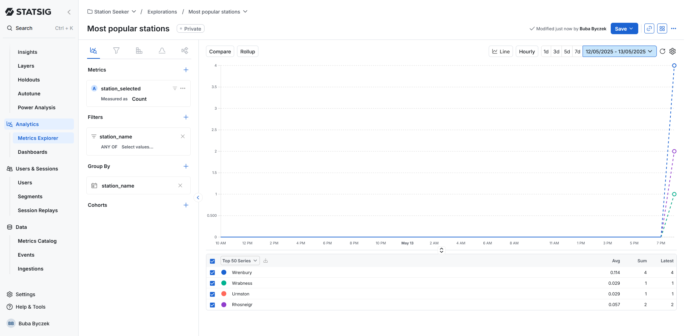

# Train Station Search Application

A Vue.js application for searching train stations, featuring a touchscreen-style interface optimized for kiosk use.

## Features

- Real-time station search with intelligent filtering
- Touchscreen keyboard interface
- Visual highlighting of valid next characters
- Recent searches history
- Responsive design for different screen sizes
- Error handling and cacheing protecting from unreliable connection

## Technologies Used

- Vue 3 with Composition API
- TypeScript for type safety
- Vite for fast development
- Trie data structure for efficient station filtering

---

## Word from the developer

Hi, welcome to my code assignment. I hope you'll find my code easy to process and assess. There are some things I would change/finish given more time. But I really wanted to deliver within the given timeframe.

#### What I am happy with:
 - **Successfull trie implementation.** I've found this solution the most elegant and best suited for the job. As was hinted in the project requirements, once it loads, it is almost real-time fast.
 - **Background caching.**  Once cached, the data is always at hand, no matter the internet connection and loading time. From the user perspective, the app works seamlessly, no matter the connection with the data source.
 - **Hand-made components.** I deliberately avoided using pre-made components/packages (for the keyboard especially) In order to demonstrate my ability to create my own custom and working components.

#### What I would revisit:
 - **Styling.** I have to admit, I am not proud of styles implementation here. I got a bit carried away on implementing the StoryBooks, which was new to me at the time, and ended up styling each component individually to better see what I can do inside my stories. I intended to clean this up later on, but we all know how this attitude works out... 
In shorter words, if given more time, I would certainly move much of the styling to a global scss file, as it is with color variables.

---

## Running with Docker

This application is containerized with Docker for easy setup and deployment.

### Prerequisites

- [Docker](https://www.docker.com/get-started)
- [Docker Compose](https://docs.docker.com/compose/install/) (optional but recommended)

### Environment Configuration (Required)

Before running the application, you must set up environment variables:

1. Copy the example environment file to create your own:

```bash
cp .env.example .env
```

2. Edit the `.env` file to configure your environment variables:
   - `VITE_API_URL`: URL to fetch station data from

The environment variables are required for both local development and Docker deployment.

### Option 1: Using Docker Compose (Recommended)

1. Clone the repository
2. Navigate to the project directory
3. Run the application:

```bash
docker-compose up -d
```

4. Access the application at http://localhost
5. To stop the application:

```bash
docker-compose down
```

### Option 2: Using Docker directly

1. Build the Docker image:

```bash
docker build -t station-search .
```

2. Run the container:

```bash
docker run -d -p 80:80 --name station-search-app station-search
```

3. Access the application at http://localhost
4. To stop the container:

```bash
docker stop station-search-app
docker rm station-search-app
```

---

## Development Setup

If you prefer to run the application without Docker for development:

1. Install dependencies:

```bash
npm install
```

2. Start the development server:

```bash
npm run dev
```

---

## User Behavior Analytics (Demo Implementation)

### Overview

This application includes a **custom analytics system** for tracking user behavior and search interactions. The analytics are implemented purely on the client side and are intended for demonstration purposes only. No data is sent to any external server or third-party service.

### Why This Approach?
- **Simplicity:** For this coding assignment, there is no need to send analytics data externally.
- **Showcasing Analytics Usage:** The implementation demonstrates how analytics tracking can be integrated into a modern web application, including event tracking and a debug UI.
- **Extensibility:** In a real-world scenario, the tracking logic could be easily adapted to send data to services like Google Analytics, Mixpanel, or a custom backend.

### How It Works
- Analytics events are tracked using the `SimpleAnalytics` class (`src/services/analytics.ts`).
- Events are stored in-memory and persisted in the browser's `localStorage`.
- Tracked events include search input, search results, station selection and character selection.
- A debug UI (`AnalyticsDebug.vue`) is available to view, inspect, and clear tracked events in real-time.

### Using the Analytics Debug UI
- The debug panel appears as a floating button at the bottom-right of the app.
- Click **"Show Analytics"** to expand the panel and view all tracked events (event name, timestamp, parameters).
- Click **"Clear Events"** to reset the analytics history (removes all events from memory and storage).
- The panel updates in real-time as you interact with the app.

### Example Events Tracked
- `search_input`: When the user types in the search box
- `search_results`: When search results are updated
- `station_selected`: When a station is selected
- `character_selected`: When a suggested character is clicked
- `search_cleared`: When the search is cleared

### Real-World Analytics
In a production environment, analytics events would typically be sent to an external analytics service for aggregation and analysis. This demo implementation keeps all data local for simplicity, privacy, and to showcase tracking logic without any setup or cost.

---

## Statsig Analytics Integration

**Note that for Statsig to initialize properly, you have to provide SDK_KEY in the .env**

This project integrates [Statsig](https://statsig.com/) for analytics and experimentation. Statsig is used to capture and analyze key user interactions, such as which train stations are selected.

### What is Tracked?
- **App usage**: Each time the app is opened, an event is logged.
- **Station selection**: Every time a user selects a station from the results, a `station_selected` event is sent to Statsig, including the station name and code.

### Example Use Case: Most Popular Stations
By aggregating `station_selected` events in Statsig, you can easily determine which stations are the most popular among users. This data can be visualized in Statsig's dashboard to gain actionable insights into user preferences and behavior.

Below is a preview of how the popularity of stations can be visualized in Statsig:


